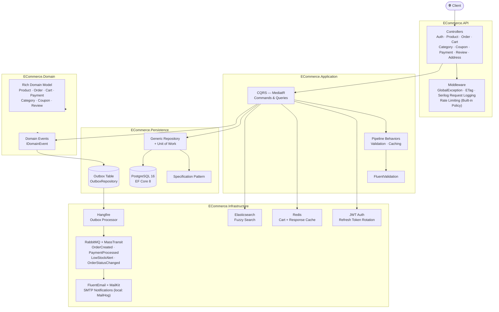

<div align="center">

[](README.md)
[](README.en.md)

# 🛒 ECommerce API

A production-ready e-commerce RESTful API built with **.NET 8**, **Clean Architecture**, and **CQRS** patterns.

[](https://github.com/Muhametaydn/ECommerceAPI/actions/workflows/ci.yml)
[](https://dotnet.microsoft.com/)
[](https://www.postgresql.org/)
[](https://redis.io/)
[](https://www.rabbitmq.com/)
[](https://www.elastic.co/)
[](https://www.docker.com/)
[](LICENSE)

</div>

---

## 📖 About the Project

This project is a comprehensive e-commerce backend API that brings together modern software-development practices. It is designed to cover real-world scenarios and includes:

- **Clean, maintainable code** — each layer has a single responsibility through Clean Architecture
- **Scalable architecture** — reads and writes are independent with CQRS
- **Reliable messaging** — events are never lost with the Outbox Pattern
- **High performance** — optimized with Redis cache, ETags, and Elasticsearch
- **Production readiness** — ready to deploy with Docker, CI/CD, and Serilog logging

---

## 🏗️ Architecture



---

## 🛠️ Tech Stack

| Category | Technology | Why? |
|---|---|---|
| Framework | .NET 8, ASP.NET Core Web API | LTS release, high performance |
| ORM | Entity Framework Core 8 | Code-first migrations, LINQ support |
| Database | PostgreSQL 16 | Reliable, ACID-compliant relational DB |
| Cache | Redis 7 | Low latency, cart + response cache |
| Search | Elasticsearch 8.13 | Fuzzy search, language analysis |
| Messaging | RabbitMQ 3.13 + MassTransit 8 | Reliable asynchronous event handling |
| Background Jobs | Hangfire | Outbox-job scheduling and retries |
| Auth | ASP.NET Identity + JWT | Industry standard, token rotation |
| Email | FluentEmail + MailKit | HTML-template support |
| Logging | Serilog | Structured logging, sink support |
| API Docs | Swagger / OpenAPI | Automatic documentation |
| Testing | xUnit, Moq, FluentAssertions, NetArchTest | Unit, integration, and architecture tests |
| DevOps | Docker, GitHub Actions | Containers and CI/CD automation |

---

## ✨ Features

### 🏛️ Clean Architecture
The project is split into four layers: **Domain → Application → Infrastructure/Persistence → API**. Each layer depends only on the layer beneath it. This keeps infrastructure changes from affecting the domain and makes testing easier.

### ⚡ CQRS + MediatR
Read (Query) and write (Command) operations are managed in fully separate handlers. MediatR pipeline behaviors automatically apply validation, caching, and logging to every request.

### 📨 Domain Events + Outbox Pattern
A domain event is raised when an order is created. The Outbox Pattern saves the event to the database; Hangfire processes it every minute and sends it to RabbitMQ. This ensures **no event is lost** — even a service crash does not compromise reliability.

### 🔐 JWT + Refresh Token Rotation
Access tokens are valid for 15 minutes and refresh tokens for 7 days. Every refresh revokes the old token and issues a new one (rotation), so even a stolen token becomes invalid quickly.

### 🚀 Redis Cache + ETag
Frequently used queries, such as the product list and category tree, are cached in Redis. When a client requests unchanged data again, the ETag middleware returns `304 Not Modified`, saving bandwidth.

### 🔍 Elasticsearch Fuzzy Search
Product searches run through Elasticsearch. Typographical errors are tolerated through fuzzy matching, and results prioritize product names.

### 📊 Policy-Based Authorization
The `Admin`, `Seller`, and `Customer` roles are defined along with the `AdminOnly`, `SellerOrAdmin`, `CustomerOnly`, and `Authenticated` policies. Every endpoint clearly specifies the roles that can access it.

### 🛡️ Rate Limiting
Auth endpoints are limited to 5 requests/minute, API endpoints to 30 requests/minute, and the global limit is 60 requests/minute per IP address. This provides DDoS and brute-force protection.

---

## 🚀 Quick Start

### Prerequisites

- [.NET 8 SDK](https://dotnet.microsoft.com/download/dotnet/8)
- [Docker & Docker Compose](https://www.docker.com/get-started)

### 1. Clone the repository

```bash
git clone https://github.com/Muhametaydn/ECommerceAPI.git
cd ECommerceAPI
```

### 2. Start infrastructure services

```bash
docker compose up -d postgres redis rabbitmq mailhog elasticsearch
```

### 3. Run the API

```bash
cd src/ECommerce.API
dotnet run
```

Swagger UI: **http://localhost:5000/swagger**

### 4. Start the full stack with Docker (optional)

```bash
docker compose up -d
```

API: **http://localhost:8080** | Swagger: **http://localhost:8080/swagger**

---

## ⚙️ Environment Variables

| Variable | Description | Default |
|---|---|---|
| `ConnectionStrings__DefaultConnection` | PostgreSQL connection string | `Host=localhost;...` |
| `ConnectionStrings__Redis` | Redis connection string | `localhost:6379` |
| `JwtSettings__SecretKey` | JWT signing key (≥32 characters) | — |
| `RabbitMQ__Host` | RabbitMQ host | `localhost` |
| `Elasticsearch__Uri` | Elasticsearch URI | `http://localhost:9200` |
| `Email__Host` | SMTP host | `localhost` |

> ⚠️ You must change `JwtSettings__SecretKey` in production.

---

## 📡 API Endpoints

### Auth — `/api/v1/auth`

| Method | Path | Description |
|---|---|---|
| `POST` | `/register` | Register a new user |
| `POST` | `/login` | Sign in → JWT + refresh token |
| `POST` | `/refresh-token` | Refresh the access token |
| `POST` | `/revoke-token` | Revoke a refresh token |

### Products — `/api/v1/products`

| Method | Path | Authorization | Description |
|---|---|---|---|
| `GET` | `/` | — | Product list (paginated and filterable) |
| `GET` | `/{id}` | — | Product detail |
| `GET` | `/search?q=...` | — | Elasticsearch fuzzy search |
| `POST` | `/` | SellerOrAdmin | Create a product |
| `PUT` | `/{id}` | SellerOrAdmin | Update a product |
| `DELETE` | `/{id}` | Admin | Delete a product |

### Orders — `/api/v1/orders`

| Method | Path | Authorization | Description |
|---|---|---|---|
| `GET` | `/` | Authenticated | My orders |
| `GET` | `/{id}` | Authenticated | Order detail |
| `POST` | `/` | Customer | Create an order |
| `PUT` | `/{id}/confirm` | SellerOrAdmin | Confirm the order |
| `PUT` | `/{id}/ship` | SellerOrAdmin | Mark as shipped |
| `PUT` | `/{id}/deliver` | SellerOrAdmin | Mark as delivered |
| `PUT` | `/{id}/cancel` | Authenticated | Cancel the order |

### Other Endpoints

| Prefix | Description |
|---|---|
| `/api/v1/cart` | Cart operations (Redis-backed) |
| `/api/v1/categories` | Hierarchical category management |
| `/api/v1/coupons` | Create and apply coupons |
| `/api/v1/addresses` | User address management |
| `/api/v1/reviews` | Product reviews |
| `/api/v1/payments` | Payment operations |

---

## 🧪 Tests

```bash
# Unit tests
dotnet test tests/ECommerce.UnitTests

# Integration tests
dotnet test tests/ECommerce.IntegrationTests

# Architecture tests (layer dependencies)
dotnet test tests/ECommerce.ArchitectureTests

# All tests
dotnet test ECommerceAPI.sln
```

---

## 🛠️ Development Tools

| Service | URL | Details |
|---|---|---|
| Swagger UI | http://localhost:5000/swagger | API documentation |
| Hangfire Dashboard | http://localhost:5000/hangfire | Background-job management (dev) |
| RabbitMQ Management | http://localhost:15672 | guest / guest |
| MailHog | http://localhost:8025 | Test email inbox |
| Kibana | http://localhost:5601 | Elasticsearch visualization |

---

## 📁 Project Structure

```
ECommerceAPI/
├── .github/
│   └── workflows/
│       └── ci.yml                 # GitHub Actions — Build · Test · Docker Push
├── src/
│   ├── ECommerce.Domain           # Entities, enums, interfaces, specifications, domain events
│   ├── ECommerce.Application      # Features (CQRS), DTOs, validators, behaviors, mapping
│   ├── ECommerce.Infrastructure   # JWT, Redis, Elasticsearch, RabbitMQ, email, Hangfire jobs
│   ├── ECommerce.Persistence      # EF Core DbContext, repositories, UoW, migrations
│   └── ECommerce.API              # Controllers, middleware, Program.cs
├── tests/
│   ├── ECommerce.UnitTests        # Domain + Application unit tests
│   ├── ECommerce.IntegrationTests # Integration tests with a real DB
│   └── ECommerce.ArchitectureTests # Layer-dependency rules (NetArchTest)
├── docker-compose.yml             # All services (prod)
├── docker-compose.override.yml    # Development-environment overrides
├── Dockerfile                     # Multi-stage build
└── ECommerceAPI.sln
```

---

## 📄 License

MIT — see the [LICENSE](LICENSE) file for details.
