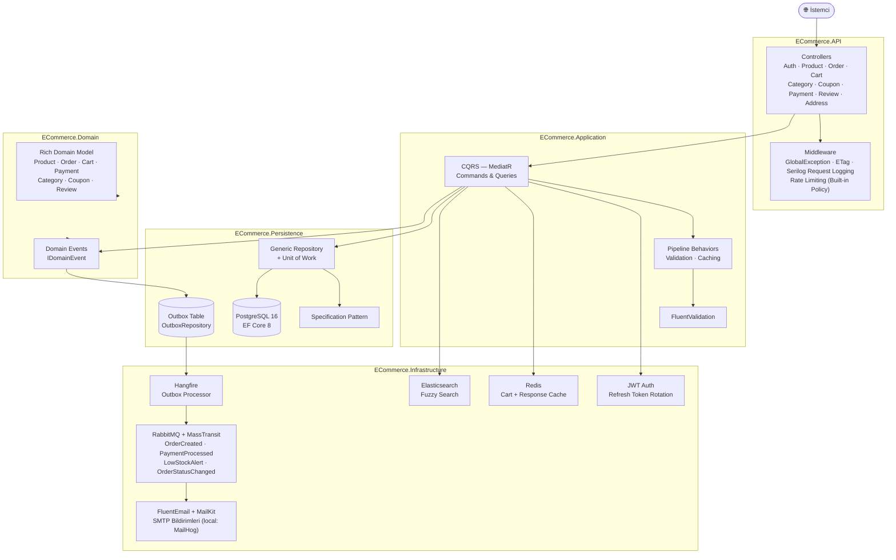

<div align="center">

# 🛒 ECommerce API

**.NET 8** ile geliştirilmiş, **Clean Architecture** ve **CQRS** desenlerini kullanan  
production-ready E-Ticaret RESTful API.

[](https://github.com/Muhametaydn/ECommerceAPI/actions/workflows/ci.yml)
[](https://dotnet.microsoft.com/)
[](https://www.postgresql.org/)
[](https://redis.io/)
[](https://www.rabbitmq.com/)
[](https://www.elastic.co/)
[](https://www.docker.com/)
[](LICENSE)

</div>

---

## 📖 Proje Hakkında

Bu proje, modern yazılım geliştirme pratiklerini bir arada kullanan kapsamlı bir e-ticaret backend API'sidir. Gerçek dünya senaryolarını karşılayacak şekilde tasarlanmış olup aşağıdaki konuları kapsamaktadır:

- **Temiz ve sürdürülebilir kod** — Clean Architecture sayesinde her katmanın tek bir sorumluluğu var
- **Ölçeklenebilir mimari** — CQRS ile okuma ve yazma işlemleri birbirinden bağımsız
- **Güvenilir mesajlaşma** — Outbox Pattern ile event'ler asla kaybolmuyor
- **Yüksek performans** — Redis cache, ETag ve Elasticsearch ile optimize edilmiş
- **Production hazırlığı** — Docker, CI/CD, Serilog logging ile deploy'a hazır

---

## 🏗️ Mimari



---

## 🛠️ Tech Stack

| Kategori | Teknoloji | Neden? |
|---|---|---|
| Framework | .NET 8, ASP.NET Core Web API | LTS sürümü, yüksek performans |
| ORM | Entity Framework Core 8 | Code-first migration, LINQ desteği |
| Veritabanı | PostgreSQL 16 | Güvenilir, ACID uyumlu ilişkisel DB |
| Cache | Redis 7 | Düşük latency, Cart + Response cache |
| Arama | Elasticsearch 8.13 | Fuzzy arama, dil analizi |
| Mesajlaşma | RabbitMQ 3.13 + MassTransit 8 | Güvenilir async event işleme |
| Background Jobs | Hangfire | Outbox job scheduling, retry mekanizması |
| Auth | ASP.NET Identity + JWT | Endüstri standardı, token rotation |
| Email | FluentEmail + MailKit | HTML template desteği |
| Loglama | Serilog | Structured logging, sink desteği |
| API Docs | Swagger / OpenAPI | Otomatik dokümantasyon |
| Test | xUnit, Moq, FluentAssertions, NetArchTest | Unit + Integration + Mimari testler |
| DevOps | Docker, GitHub Actions | Container + CI/CD otomasyonu |

---

## ✨ Özellikler

### 🏛️ Clean Architecture
Proje 4 katmana ayrılmıştır: **Domain → Application → Infrastructure/Persistence → API**. Her katman yalnızca bir alt katmana bağımlıdır. Bu sayede infrastructure değişiklikleri domain'i etkilemez, test yazımı kolaylaşır.

### ⚡ CQRS + MediatR
Okuma (Query) ve yazma (Command) işlemleri tamamen ayrı handler'larda yönetilir. MediatR pipeline behavior'ları ile her request için otomatik validation, caching ve logging uygulanır.

### 📨 Domain Events + Outbox Pattern
Sipariş oluşturulduğunda domain event raise edilir. Outbox pattern sayesinde event veritabanına kaydedilir, Hangfire her dakika işleyip RabbitMQ'ya iletir. Böylece **hiçbir event kaybolmaz** — servis çökmesi bile güvenliği bozmaz.

### 🔐 JWT + Refresh Token Rotation
Access token 15 dakika, refresh token 7 gün geçerlidir. Her refresh işleminde eski token iptal edilip yenisi üretilir (rotation). Bu sayede token çalınsa bile kısa sürede geçersiz hale gelir.

### 🚀 Redis Cache + ETag
Sık kullanılan sorgular (ürün listesi, kategori ağacı) Redis'te önbelleğe alınır. ETag middleware ile istemci aynı veriyi tekrar istediğinde `304 Not Modified` döner — bandwidth tasarrufu sağlar.

### 🔍 Elasticsearch Fuzzy Search
Ürün araması Elasticsearch üzerinden yapılır. Yazım hataları tolere edilir (fuzzy matching), ürün adına ağırlık verilerek sıralama yapılır.

### 📊 Policy-Based Authorization
`Admin`, `Seller`, `Customer` rolleri ve bunlara göre `AdminOnly`, `SellerOrAdmin`, `CustomerOnly`, `Authenticated` policy'leri tanımlıdır. Her endpoint hangi role açık olduğunu açıkça belirtir.

### 🛡️ Rate Limiting
Auth endpoint'leri 5 istek/dakika, API endpoint'leri 30 istek/dakika, global ise IP başına 60 istek/dakika ile sınırlandırılmıştır. DDoS ve brute force koruması sağlar.

---

## 🚀 Hızlı Başlangıç

### Gereksinimler

- [.NET 8 SDK](https://dotnet.microsoft.com/download/dotnet/8)
- [Docker & Docker Compose](https://www.docker.com/get-started)

### 1. Repoyu klonla

```bash
git clone https://github.com/Muhametaydn/ECommerceAPI.git
cd ECommerceAPI
```

### 2. Altyapı servislerini başlat

```bash
docker compose up -d postgres redis rabbitmq mailhog elasticsearch
```

### 3. API'yi çalıştır

```bash
cd src/ECommerce.API
dotnet run
```

Swagger UI: **http://localhost:5000/swagger**

### 4. Tüm stack'i Docker ile başlat (opsiyonel)

```bash
docker compose up -d
```

API: **http://localhost:8080** | Swagger: **http://localhost:8080/swagger**

---

## ⚙️ Ortam Değişkenleri

| Değişken | Açıklama | Varsayılan |
|---|---|---|
| `ConnectionStrings__DefaultConnection` | PostgreSQL bağlantı dizesi | `Host=localhost;...` |
| `ConnectionStrings__Redis` | Redis bağlantı dizesi | `localhost:6379` |
| `JwtSettings__SecretKey` | JWT imzalama anahtarı (≥32 karakter) | — |
| `RabbitMQ__Host` | RabbitMQ host | `localhost` |
| `Elasticsearch__Uri` | Elasticsearch URI | `http://localhost:9200` |
| `Email__Host` | SMTP host | `localhost` |

> ⚠️ Production'da `JwtSettings__SecretKey` mutlaka değiştirilmelidir.

---

## 📡 API Endpoints

### Auth — `/api/v1/auth`

| Method | Path | Açıklama |
|---|---|---|
| `POST` | `/register` | Yeni kullanıcı kaydı |
| `POST` | `/login` | Giriş → JWT + Refresh token |
| `POST` | `/refresh-token` | Access token yenileme |
| `POST` | `/revoke-token` | Refresh token iptal |

### Products — `/api/v1/products`

| Method | Path | Yetki | Açıklama |
|---|---|---|---|
| `GET` | `/` | — | Ürün listesi (sayfalı, filtrelenebilir) |
| `GET` | `/{id}` | — | Ürün detayı |
| `GET` | `/search?q=...` | — | Elasticsearch fuzzy arama |
| `POST` | `/` | SellerOrAdmin | Ürün oluştur |
| `PUT` | `/{id}` | SellerOrAdmin | Ürün güncelle |
| `DELETE` | `/{id}` | Admin | Ürün sil |

### Orders — `/api/v1/orders`

| Method | Path | Yetki | Açıklama |
|---|---|---|---|
| `GET` | `/` | Authenticated | Siparişlerim |
| `GET` | `/{id}` | Authenticated | Sipariş detayı |
| `POST` | `/` | Customer | Sipariş oluştur |
| `PUT` | `/{id}/confirm` | SellerOrAdmin | Siparişi onayla |
| `PUT` | `/{id}/ship` | SellerOrAdmin | Kargoya ver |
| `PUT` | `/{id}/deliver` | SellerOrAdmin | Teslim edildi |
| `PUT` | `/{id}/cancel` | Authenticated | İptal et |

### Diğer Endpoint'ler

| Prefix | Açıklama |
|---|---|
| `/api/v1/cart` | Sepet işlemleri (Redis tabanlı) |
| `/api/v1/categories` | Hiyerarşik kategori yönetimi |
| `/api/v1/coupons` | Kupon oluşturma ve uygulama |
| `/api/v1/addresses` | Kullanıcı adres yönetimi |
| `/api/v1/reviews` | Ürün değerlendirmeleri |
| `/api/v1/payments` | Ödeme işlemleri |

---

## 🧪 Testler

```bash
# Unit testler
dotnet test tests/ECommerce.UnitTests

# Entegrasyon testleri
dotnet test tests/ECommerce.IntegrationTests

# Mimari testler (katman bağımlılıkları)
dotnet test tests/ECommerce.ArchitectureTests

# Tümü
dotnet test ECommerceAPI.sln
```

---

## 🛠️ Geliştirme Araçları

| Servis | URL | Bilgi |
|---|---|---|
| Swagger UI | http://localhost:5000/swagger | API dokümantasyonu |
| Hangfire Dashboard | http://localhost:5000/hangfire | Background job yönetimi (dev) |
| RabbitMQ Management | http://localhost:15672 | guest / guest |
| MailHog | http://localhost:8025 | Test email inbox |
| Kibana | http://localhost:5601 | Elasticsearch görselleştirme |

---

## 📁 Proje Yapısı

```
ECommerceAPI/
├── .github/
│   └── workflows/
│       └── ci.yml               # GitHub Actions — Build · Test · Docker Push
├── src/
│   ├── ECommerce.Domain         # Entity, Enum, Interface, Specification, Domain Events
│   ├── ECommerce.Application    # Features (CQRS), DTOs, Validators, Behaviors, Mapping
│   ├── ECommerce.Infrastructure # JWT, Redis, Elasticsearch, RabbitMQ, Email, Hangfire Jobs
│   ├── ECommerce.Persistence    # EF Core DbContext, Repositories, UoW, Migrations
│   └── ECommerce.API            # Controllers, Middleware, Program.cs
├── tests/
│   ├── ECommerce.UnitTests      # Domain + Application katmanı unit testleri
│   ├── ECommerce.IntegrationTests # Gerçek DB ile entegrasyon testleri
│   └── ECommerce.ArchitectureTests # Katman bağımlılık kuralları (NetArchTest)
├── docker-compose.yml           # Tüm servisler (prod)
├── docker-compose.override.yml  # Dev ortamı overrides
├── Dockerfile                   # Multi-stage build
└── ECommerceAPI.sln
```

---

## 📄 Lisans

MIT — Detaylar için [LICENSE](LICENSE) dosyasına bakın.
